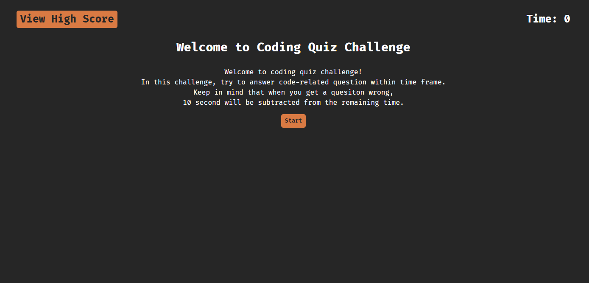

# Timed Code Quiz

## Description

This website is place to test your knowlege of simple JavaScript. The user is given 90 secons to complete 6 questions with 4 multiple choice. When user choose an answer, the user is notified at the bottom of the question on wether user chose right or wrong answer. Also, they will be notified with color on which is right answer and what is the wrong answer. When user choose wrong answer, then the time is subtracted by 10 seconds and at the and remaining time is the score. To start the game, user click on the start button and when the quiz is finished, user is given a score and input box to put in initials then when user submits, then user is taken to score board page with score and initial written and choice to restart the game or to reset the score board. Also, user can access score board anytime when they click on the 'View High Score'. The scores are stored locally.

## Screenshot

## Tech Used

## Link
<a href="https://connorcho66.github.io/timed-code-quiz/">Link to depoloyed website</a>

## License

N/A

## Contact

<ul>
    <li><b>Email: </b> <a href="connorcho22@gmail.com">connorcho22@gmail.com</a></li>
    <li><b>Github: </b> <a href="https://github.com/connorcho66">connorcho66</a></li>
    <li><b>Linked In: </b> <a href="www.linkedin.com/in/seongyun-cho-89a8a61a0">SeongYun Cho</a></li>
</ul>